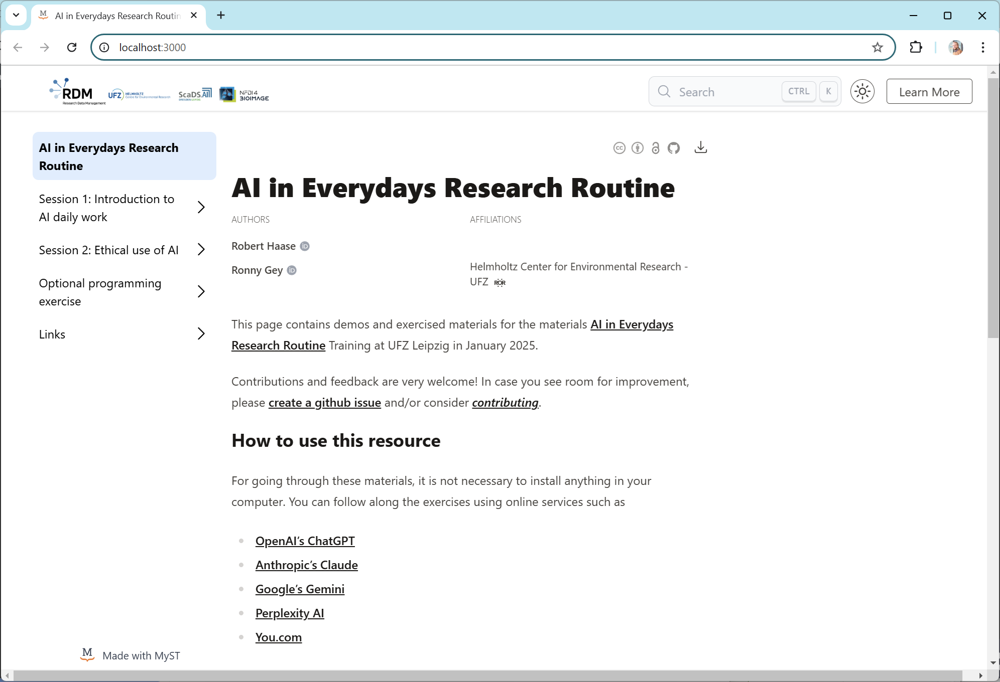

# AI in Everydays Research Routine

This Jupyter book is rendered to this website:

<https://scads.github.io/ai_training_ufz_2025>

It is maintained using [Jupyter lab](https://jupyterlab.readthedocs.io/en/stable/) and build using [Jupyter book](https://jupyterbook.org/intro.html).

To edit this book, install depencencies like this:

```bash
git clone https://github.com/ScaDS/ai_training_ufz_2025.git
cd  ai_training_ufz_2025
pip install -r requirements.txt
```

For modifying the LLM-notebooks (optional), make sure [ipy-llm-kernel](https://github.com/haesleinhuepf/ipy-llm-kernel?tab=readme-ov-file#installation) is properly installed:

```bash
python -m ipy_llm_kernel install
```

To build the book, you can run this from the `docs` folder:

```bash
cd docs
myst init
myst build
myst start #starts a web server with the built content at https://localhost:3000
```

The book is built into `docs/_build/site/`. It should look like this:

  

## Acknowledgements

We acknowledge the financial support by the Federal Ministry of Education and Research of Germany and by Sächsische Staatsministerium für Wissenschaft, Kultur und Tourismus in the programme Center of Excellence for AI-research „Center for Scalable Data Analytics and Artificial Intelligence Dresden/Leipzig“, project identification number: ScaDS.AI
